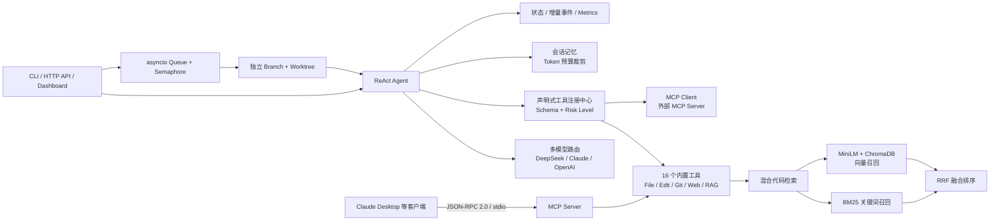

# 码搭 CodePilot

[](https://github.com/xiaofengche123/codepilot/actions/workflows/test.yml)
[](https://www.python.org/)
[](LICENSE)

本地智能编程助手 Agent 平台，提供 **CLI、HTTP API 和 Web Dashboard** 三种使用方式。基于 ReAct 与 Function Calling 构建，支持自然语言驱动的代码检索与修改、Git 操作、MCP 工具扩展、RAG 混合检索和多任务隔离执行。

## 特性

- **多模型路由** — DeepSeek / Claude / OpenAI 自动检测可用性，手动 `/model` 热切换
- **16 个内置工具** — 文件读写、事务式局部编辑、代码搜索、Shell、Git、Web 与混合检索
- **ReAct Agent** — 推理-行动-观察循环，最多 10 轮迭代，工具调用实时可见
- **MCP Tools 双端** — Server 供 Claude Desktop 调用，Client 消费外部 MCP Server 工具
- **RAG 混合检索与精排** — BM25 + ChromaDB 向量召回、RRF 融合，并可用多语言 Cross-Encoder 精排
- **轻量代码结构图** — 已定义内容无关、稳定可序列化的 Python 文件/类/函数节点契约；边解析按阶段实施
- **事务式代码编辑** — SHA 乐观并发控制、全量预检、Python AST 校验、同目录临时文件与原子替换
- **对话记忆** — 按项目持久化对话历史，支持上下文裁剪
- **流式输出** — 实时显示 AI 回复，工具调用过程透明
- **任务服务化** — FastAPI + asyncio 并发调度，Git Worktree 隔离任务工作区

## 系统架构



## 快速开始

### 安装

```bash
git clone https://github.com/xiaofengche123/codepilot.git
cd codepilot
python install.py
```

### 配置

复制 `.env.example` 为 `.env`，填入至少一个 API Key：

```bash
# DeepSeek（推荐，免费额度）
DEEPSEEK_API_KEY=sk-xxx
DEEPSEEK_BASE_URL=https://api.deepseek.com
```

### 启动

```bash
python main.py              # 交互模式
python main.py "帮我看看这个项目"  # 单次模式
python main.py -d /path/to/project  # 指定工作目录
```

## 交互命令

| 命令 | 说明 |
|------|------|
| `/model` | 显示可用模型列表 |
| `/model <name>` | 切换模型（如 `/model deepseek-chat`） |
| `/git` | 显示 Git 仓库状态和分支 |
| `/index` | 索引当前项目代码（为语义搜索准备） |
| `/index --force` | 强制重建索引 |
| `/clear` | 清除当前项目对话历史 |
| `/history` | 查看历史提问 |
| `/mcp` | 查看 MCP 服务器连接状态 |
| `/dir <path>` | 切换工作目录 |
| `exit` | 退出 |

## 工具列表

| 分类 | 工具 | 说明 |
|------|------|------|
| 核心 | `read_file` | 读取文件内容 |
| 核心 | `write_file` | 写入/覆盖文件 |
| 编辑 | `edit_file_transaction` | 精确局部编辑；SHA、语法、原子写入与失败回滚 |
| 核心 | `list_files` | 列出目录内容 |
| 核心 | `search_code` | 正则搜索代码 |
| 核心 | `run_shell` | 执行终端命令（需确认） |
| Git | `git_status` | 查看工作区状态 |
| Git | `git_diff` | 查看差异 |
| Git | `git_log` | 查看提交日志 |
| Git | `git_branch` | 列出分支 |
| Git | `git_add` | 暂存文件（需确认） |
| Git | `git_commit` | 提交（需确认） |
| Web | `web_search` | DuckDuckGo 搜索 |
| Web | `web_fetch` | 抓取网页内容 |
| RAG | `index_project` | 向量化索引项目 |
| RAG | `search_semantic` | BM25 + 向量混合检索代码 |

## MCP 集成

### 作为 MCP Server

在 Claude Desktop 配置中添加，即可在 Claude Desktop 中使用 CodePilot 的 16 个工具：

```json
{
  "mcpServers": {
    "codepilot": {
      "command": "python",
      "args": ["-m", "mcp.server"],
      "cwd": "D:/codepilot"
    }
  }
}
```

### 作为 MCP Client

编辑 `mcp_servers.json` 配置要连接的外部 MCP Server：

```json
{
  "servers": [
    {
      "name": "filesystem",
      "transport": "stdio",
      "command": "npx",
      "args": ["-y", "@modelcontextprotocol/server-filesystem", "."]
    }
  ]
}
```

启动 CodePilot 后会自动连接并发现工具，工具名以 `mcp_{server}_{tool}` 格式注册。
单个外部 Server 初始化失败只会跳过该连接，不会中止 Agent 启动；可在对应
Server 配置中通过 `timeout` 设置初始化和调用超时。

## HTTP API 与任务隔离

启动服务：

```bash
python server.py
```

提交任务时必须传入 Git 仓库目录。服务为每个任务创建独立分支和 Git
Worktree；隔离创建失败时任务会失败，不会降级到原工作区执行。

```bash
curl -X POST http://localhost:8000/tasks/submit \
  -H "Content-Type: application/json" \
  -d '{"input":"检查项目中的异常处理","project_dir":".","session_id":"demo"}'
```

响应示例：

```json
{
  "task_id": "task-000001",
  "status": "pending"
}
```

- `GET /tasks/{task_id}`：查询状态和最终结果
- `GET /tasks/{task_id}/events?cursor=0`：增量拉取流式文本、工具调用和生命周期事件
- `DELETE /tasks/{task_id}`：取消尚未开始的任务
- `GET /metrics`：Prometheus 文本格式任务指标

任务状态查询示例：

```json
{
  "task_id": "task-000001",
  "status": "completed",
  "input": "检查项目中的异常处理",
  "result": "已检查异常处理路径并给出修改建议",
  "error": null,
  "diff": ""
}
```

相同 `project_dir` 与 `session_id` 使用同一份 JSON 对话历史；代码在临时
Worktree 中执行，历史则持久化到原项目的 `.codepilot/sessions/`。

## Docker 部署

在 `.env` 中配置至少一个模型 API Key 后执行：

```bash
docker compose up -d --build
docker compose ps
```

Dashboard 地址为 `http://localhost:8000`。Compose 会将当前 Git 仓库挂载为
任务项目，并使用独立数据卷保存临时 Worktree。镜像包含 `/health` 健康检查。

Dashboard 可提交 Agent 任务并查看运行状态、流式输出、工具调用过程和任务指标。

## RAG 混合检索与 Cross-Encoder 精排

1. 进入项目目录，运行 `/index` 索引代码
2. 首次使用精排前显式准备模型（只需一次）
3. 之后 Agent 可调用 `search_semantic` 进行自然语言搜索

```bash
# 已有缓存时只检查本地模型
python -m rag.reranker

# 首次安装时允许下载多语言 Cross-Encoder
python -m rag.reranker --download
```

```
你: 找到处理用户登录校验的代码
Agent: [调用 search_semantic("用户登录校验逻辑")]
       → auth/login.py:32  def validate_login(username, password)
       → middleware/auth.py:18  class AuthMiddleware
```

- Python 文件按函数/类 AST 精确切分
- 其他语言按 30 行固定窗口切分
- 向量模型：`all-MiniLM-L6-v2`（本地运行）
- 关键词召回：内置 Okapi BM25，支持代码标识符和中英文注释分词
- 融合排序：RRF（Reciprocal Rank Fusion），对两路结果统一排序并按 chunk ID 去重
- 自适应路由：设置 `rag.adaptive_routing.enabled=true` 后，Hybrid/Rerank 候选阶段根据有界 QueryFeatures 和双路排名置信信号消费冻结 Router；默认关闭，异常时复用同批候选回退固定 RRF
- 精排：启用后对 RRF Top-30 使用 `mmarco-mMiniLMv2-L12-H384-v1` 进行 `(query, chunk)` 成对打分，再返回最终 Top-K；CPU 默认关闭
- 回退：模型未安装或推理失败时返回 RRF 结果，并在结果 metadata 标记 `rerank_fallback`
- 检索分域：默认搜索源码/配置，避免 README 等说明文档压过真实实现；可用 `rag.include_docs=true` 开启文档检索
- 增量索引：按文件 mtime 跳过未修改文件
- 索引 schema 升级：检测到缺少 `content_type` 的旧版索引状态时，下一次 `/index` 会自动完整重建

可在 `config/settings.yaml` 中调整候选集倍数、BM25、RRF、自适应路由及 Reranker。需要高质量
模式时可设置 `rag.reranker.enabled=true` 并在服务 readiness 前预热；默认保留低延迟的
BM25 + Vector + RRF 链路。在线查询不隐式下载模型，避免首个请求长时间阻塞。

### 离线评估

评估集采用 JSON 数组，每条数据包含查询和相关文件路径（也支持精确 chunk ID）：

```json
[
  {"query": "用户登录校验", "relevant": ["auth/login.py"]},
  {"query": "创建独立工作区", "relevant": ["worktree_manager.py"]}
]
```

项目完成索引后，对比 BM25、Vector、Hybrid 与 Rerank 的 Recall@K、MRR、
平均延迟、P95 延迟和精排回退率：

```bash
python -m rag.evaluate .rag-eval/codepilot-dev.json --project . -k 10
```

## 项目结构

```
codepilot/
├── main.py              # CLI 入口
├── agent.py             # Agent ReAct 循环
├── model_router.py      # 多模型路由
├── memory.py            # 对话记忆
├── context_mgr.py       # 上下文管理
├── config.py            # 配置加载器
├── server.py            # FastAPI 服务与指标接口
├── task_queue.py        # 异步任务队列与并发控制
├── worktree_manager.py  # Git Worktree 隔离
├── events.py            # 增量任务事件
├── install.py           # 一键安装
├── Dockerfile
├── docker-compose.yml
├── requirements.txt     # Python 依赖
├── mcp_servers.json     # MCP Client 配置
├── .env.example         # API Key 模板
├── config/
│   └── settings.yaml    # 配置文件
├── tools/
│   ├── __init__.py      # 工具统一入口
│   ├── registry.py      # 声明式注册与风险等级
│   ├── core_tools.py    # 核心工具 (5)
│   ├── git_tools.py     # Git 工具 (6)
│   ├── web_tools.py     # Web 工具 (2)
│   └── rag_tools.py     # RAG 工具 (2)
├── mcp/
│   ├── protocol.py      # JSON-RPC 2.0 + MCP 消息
│   ├── server.py        # MCP Server
│   └── client.py        # MCP Client
├── rag/
│   ├── indexer.py       # AST 切分与增量索引
│   ├── code_graph.py    # 稳定代码图节点与边契约
│   ├── code_graph_builder.py # 内存 AST 结构关系构图器
│   ├── retriever.py     # BM25 + 向量 + RRF
│   └── evaluate.py      # Recall@K / MRR 离线评估
├── static/
│   └── dashboard.html   # Web Dashboard
└── tests/               # 单元、集成与端到端测试
```

## 技术栈

- **LLM**: DeepSeek / Claude / OpenAI（LangChain 统一接口）
- **Agent**: ReAct 模式，Function Calling
- **向量存储**: ChromaDB + SentenceTransformers
- **检索排序**: Okapi BM25 + RRF
- **MCP**: JSON-RPC 2.0 over stdio
- **Web**: DuckDuckGo Search + httpx + BeautifulSoup
- **CLI**: Rich
- **配置**: YAML + dotenv

## 测试

```bash
pip install pytest
pytest tests/ -v
```

当前测试基线（Python 3.11/3.12 均纳入 GitHub Actions）：

```text
551 tests collected
547 passed, 4 skipped
```

测试覆盖声明式工具注册、MCP 标准初始化及 stdio 异构端到端链路、Git
Worktree 隔离、RAG 增量索引与删除清理、服务端流式事件、会话记忆、上下文
裁剪、BM25 排序、RRF 融合、Cross-Encoder 精排/回退及检索评估指标。真实 LLM 测试默认跳过，可通过
`CODEPILOT_RUN_LLM_TESTS=1` 显式启用。

## 许可证

[MIT](LICENSE)
